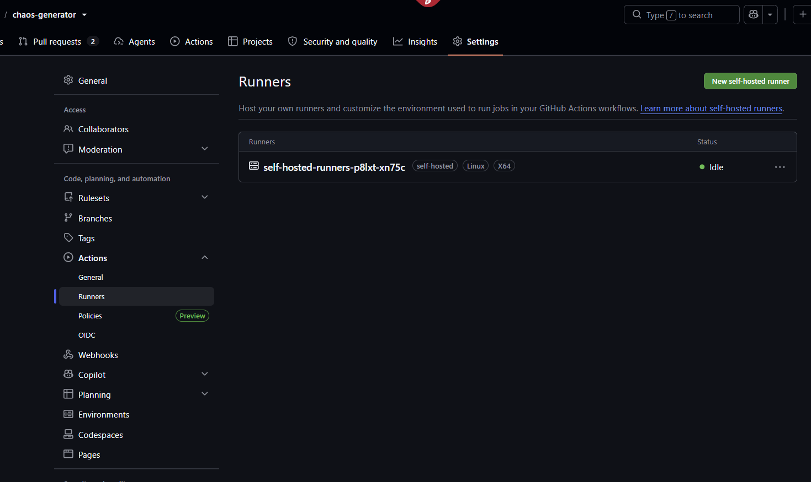

# GitHub Self Hosted Runners with K8s Setup

Documentation used:
- https://github.com/kenmuse/actions-runner-controller/blob/b087a719618540bcf349b18196c626db1687d9a9/docs/quickstart.md
- https://dev.to/viradiaharsh/hosting-self-hosted-github-runners-on-kubernetes-o2d

## Pre-requisites
- helm cli
- kubectl cli
- kind cli + cluster

## Step 1: Install cert manager on cluster

Install repo using helm
```sh
helm repo add jetstack https://charts.jetstack.io
helm repo update
helm search repo cert-manager
```

Update current cluster with cert manager and add new namespace

Sample command:
```sh
helm install \
cert-manager jetstack/cert-manager \
--namespace=NAMESPACE-NAME \
--create=namespace \
--version=LATEST-VERSION \
--set prometheus.enabled=false \
--set isntallCRDs=true
```

Command used:
```sh
helm upgrade --install cert-manager jetstack/cert-manager \
--namespace cert-manager \
--create-namespace \
--set crds.enabled=true \
--wait
```

Check if cert manager has been installed in new namespace

```sh
kubectl get pods -n cert-manager
```

Output:
```sh
NAME                                       READY   STATUS    RESTARTS      AGE
cert-manager-54b7dc69c4-r2ksl              1/1     Running   2 (15m ago)   118m
cert-manager-cainjector-8677bbdb7f-hrgbg   1/1     Running   0             118m
cert-manager-webhook-55b94f85b4-ql6cm      1/1     Running   0             118m
```

## Step 2: Add github action runner to helm repo

```sh
helm repo add actions-runner-controller https://actions-runner-controller.github.io/actions-runner-controller
helm search repo actions
```

From the cli, you should have the following repo added to helm:
```sh
helm repo list
```

Output
```sh
NAME                            URL
argo                            https://argoproj.github.io/argo-helm
actions-runner-controller       https://actions-runner-controller.github.io/actions-runner-controller
jetstack                        https://charts.jetstack.io
```

## Step 3: Connec k8s cluster to githtub action
Choose between using pat token and github app auth setup.
For local development, use PAT token for ease.

### Step 3.1: Using GitHub PAT Token

Update the current k8s cluster with a new namespace for the github action runner:

```sh
helm upgrade --install --namespace actions-runner-system --create-namespace\
  --set=authSecret.create=true\
  --set=authSecret.github_token="REPLACE_YOUR_TOKEN_HERE"\
  --wait actions-runner-controller actions-runner-controller/actions-runner-controller
```

Output
```sh
Release "actions-runner-controller" does not exist. Installing it now.
NAME: actions-runner-controller
LAST DEPLOYED: Sun Sep 13 13:42:50 2026
NAMESPACE: actions-runner-system
STATUS: deployed
REVISION: 1
DESCRIPTION: Install complete
TEST SUITE: None
NOTES:
1. Get the application URL by running these commands:
  export POD_NAME=$(kubectl get pods --namespace actions-runner-system -l "app.kubernetes.io/name=actions-runner-controller,app.kubernetes.io/instance=actions-runner-controller" -o jsonpath="{.items[0].metadata.name}")
  export CONTAINER_PORT=$(kubectl get pod --namespace actions-runner-system $POD_NAME -o jsonpath="{.spec.containers[0].ports[0].containerPort}")
  echo "Visit http://127.0.0.1:8080 to use your application"
  kubectl --namespace actions-runner-system port-forward $POD_NAME 8080:$CONTAINER_PORT
```

### Step 3.2: Using GitHub Apps

Create a github app and store the CLIENT_ID and SSH_KEY

Create a Kubernets secret for the runner.
```sh
kubectl create secret generic controller-manager\
-n actions \
--from-literal=github_app_id=APP-ID \
--from-literal=github_app-installation_id=UNIQUE-ID \
--from-literal=fiirhub_app_private_key=PRIVATE-KEY-FILE
```

Install the helm repo with the latest version
```sh
helm install runner \
actions-runner-controller/actions-runner-controller \
--namespace actions \
--version LATEST-VERSION \
--set syncPeriod=1m
```

Check the actions pods are up and running or not with the below command.
```sh
kubectl get pods -n actions
```

## Step 4: Verification

Verify if CRD Certificates exists

```sh
kubectl get crd certificates.cert-manager.io issuers.cert-manager.io
```

## Step 5: Deployment of runner manifest

Deploy the runner manifest to new namespace that holds action runner with this command:

```sh
kubectl apply -n actions-runner-system -f infrastructure/k8s/platform/github-runner/runner-deployment.yaml
```

Runner Deployment manifest:
```yaml
apiVersion: actions.summerwind.dev/v1alpha1
kind: RunnerDeployment
metadata:
  name: arc-runner
  namespace: default
spec:
  template:
    spec:
      repository: # specify name of the repository
      labels:
        - # runner label
```

Optional Autoscalling runner:
```yaml
apiVersion: actions.summerwind.dev/v1alpha1
kind: HorizontalRunnerAutoscaler
metadata:
  name: k8s-runner-autoscaler
spec:
  scaleTargetRef:
    kind: RunnerDeployment
    name: k8s-runners
  scaleDownDelaySecondsAfterScaleOut: 300
  minReplicas: 1
  maxReplicas: 10
  metrics:
  - type: TotalNumberOfQueuedAndInProgressWorkflowRuns
    repositoryNames:
    - # specify name of the repository
```

or in-line apply

```sh
cat <<EOF | kubectl apply -n actions-runner-system -f -
apiVersion: actions.summerwind.dev/v1alpha1
kind: RunnerDeployment
metadata:
  name: self-hosted-runners
spec:
  replicas: 1
  template:
    spec:
      repository: ryanjks/chaos-generator
EOF
```

Validate new namespace and pods with runner:
Command:
```sh
kubectl get pods -n actions-runner-system
```

Output:
```sh
NAME                                        READY   STATUS    RESTARTS   AGE
actions-runner-controller-864fd859b-c9b67   2/2     Running   0          10m
self-hosted-runners-p8lxt-xn75c             2/2     Running   0          27s
```

The self-hosted-runners-* should appear on the github repo that was registered here from the above manifest template:
```sh
  template:
    spec:
      repository: ryanjks/chaos-generator
```

<div align="center">
  
</div>

## Step 6: Run commands inside runners

Exec into self hosted runner pod
```sh
kubectl exec -ti self-hosted-runners-p8lxt-xn75c -n actions-runner-system -- sh
```

## Step 7: Connect argocd server to endpoint

Get the services for argocd
```sh
kubectl get svc -n argocd
```

Output:

```sh
NAME                               TYPE        CLUSTER-IP      EXTERNAL-IP   PORT(S)             AGE
argocd-applicationset-controller   ClusterIP   10.96.225.66    <none>        7000/TCP            16h
argocd-dex-server                  ClusterIP   10.96.222.115   <none>        5556/TCP,5557/TCP   16h
argocd-redis                       ClusterIP   10.96.29.231    <none>        6379/TCP            16h
argocd-repo-server                 ClusterIP   10.96.55.137    <none>        8081/TCP            16h
argocd-server                      ClusterIP   10.96.55.24     <none>        80/TCP,443/TCP      16h
```

Exec into the runner's pod from [#Step 6](#step-6-run-commands-inside-runners) and check the connection to the argocd which is in a **different namespace**

```sh
curl https://<argocd server svc name>.<namespace server>

curl -k https://argocd-server.argocd
```

This is the endpoint `argocd-server.argocd` to login from argocd cli in github actions workflows
